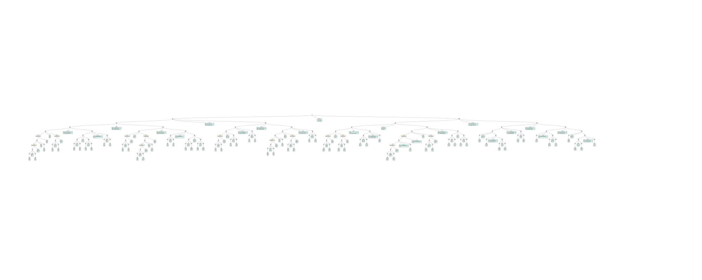
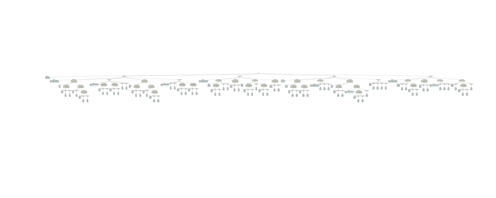
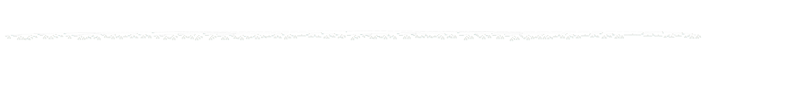
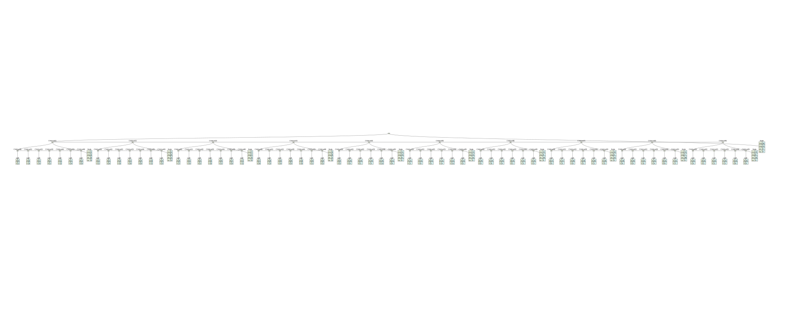
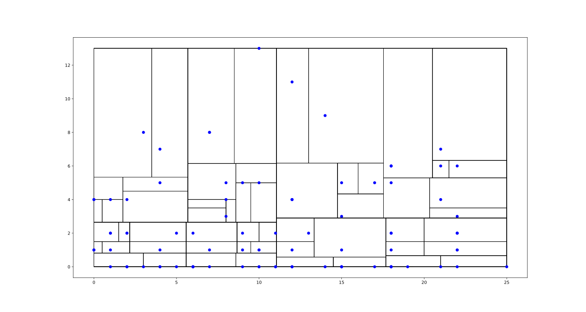
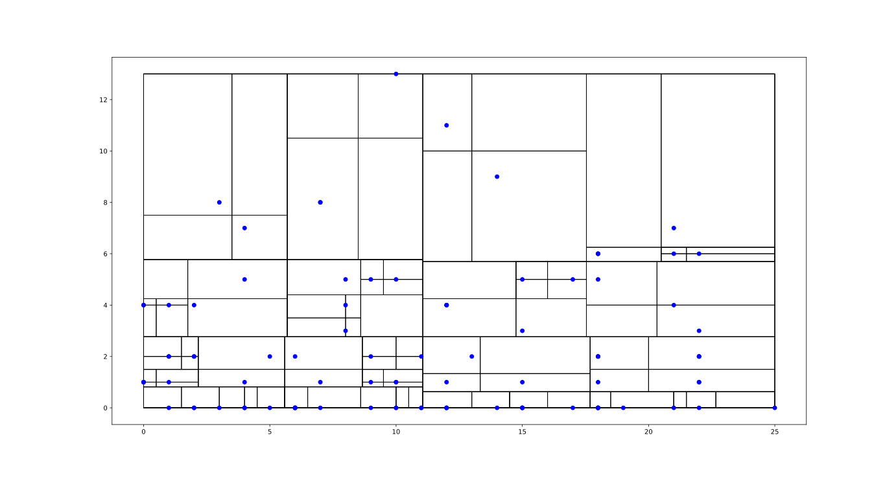
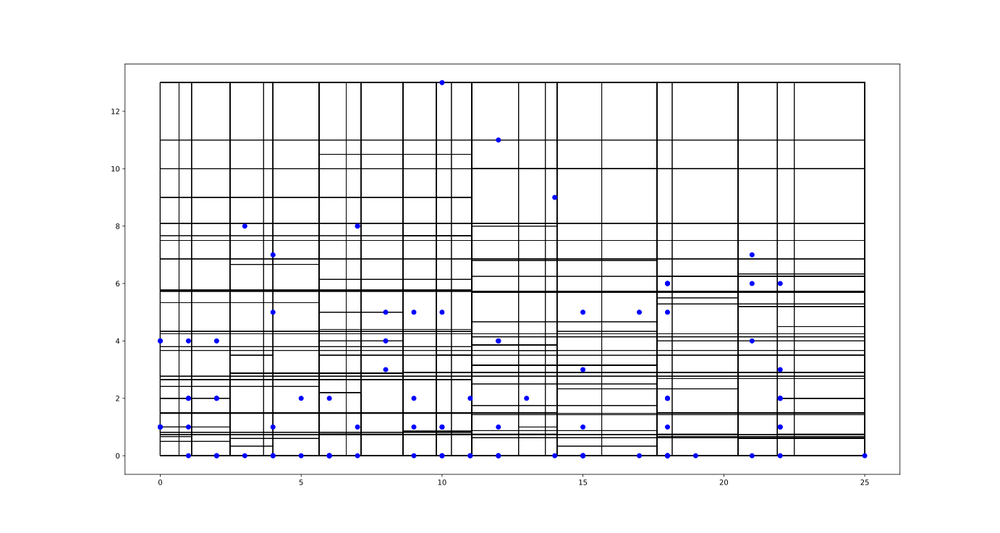
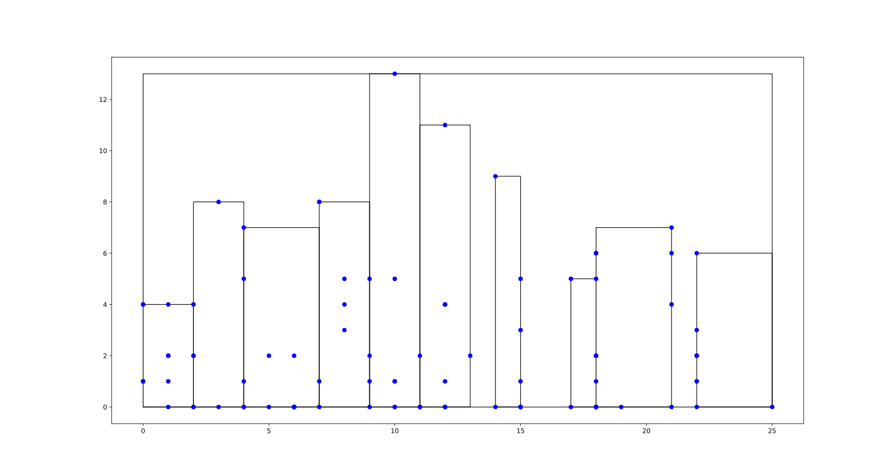
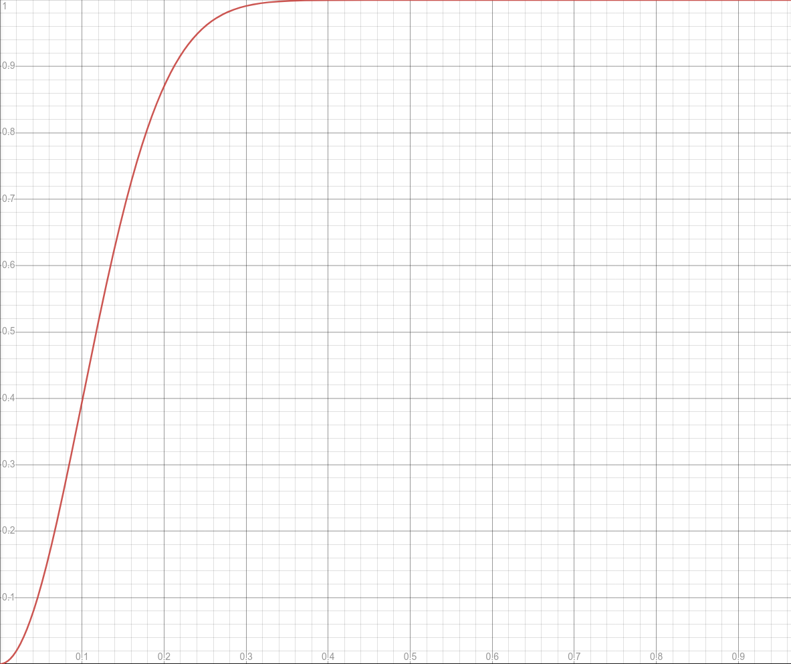

\pagebreak

# Εκτελέσιμο

Το αρχείο Demo είναι ένα εκτελέσιμο για linux. Το Demo δέχεται σε μια γραμμή το ελάχιστο και μέγιστο γράμμα που μπορεί να αρχίζει
το όνομα του επιστήμονα και το ελάχιστο και μέγιστο αριθμό βραβείων που μπορεί να έχει, με αυτή τη σειρά, και τυπώνει τα
ζεύγη επιστημόνων που πληρούν αυτά τα κριτήρια και έχουν ομοιότητα στην εκπαίδευση >20%.

## Παράδειγμα

``````
> ./Demo
G L 1 3
KOLODNER 1
JURAFSKY 1

KOWALSKI 1
GHAHRAMANI 2

KOWALSKI 1
JURAFSKY 1

JONES 2
KOLODNER 1

``````

## Screenshot Εκτέλεσης


\pagebreak

# Γενικά για το πρότζεκτ

Το πρότζεκτ υλοποιήθηκε σε Haskell. Μπορεί να χτιστεί με GHC 9.2.4 και cabal 3.

Τα δέντρα αποθηκεύουν πληροφορία σε μορφή Point. Ένα Point περιέχει δυο νούμερα x και y που δηλώνουν το πρώτο γράμμα του ονόματος
και τον αριθμό βραβείων και μια λίστα stuff με δείκτες προς τους επιστήμονες που περιγράφει.
Επίσης καταγραφούν σε ποια από τις δυο διαστάσεις πρέπει να συγκριθούν μεταξύ τους.

Τα τέσσερα είδη δέντρων (Kdtree,Qtree,RangeTree,R-Tree) συγκρίθηκαν ως προς την ταχύτητα στο range querry.
Το Kdtree αποδείχτηκε το πιο γρήγορο και χρησιμοποιήθηκε στο Demo.
Οι δείκτες προς τους επιστήμονες αντιστοιχίζονται σε προϋπολογισμένες υπογραφές LSH και βρίσκονται τα ζεύγη που
καταλήγουν στον ίδιο κουβά σε τουλάχιστον ένα band. Στη συνέχεια φιλτράρονται έτσι ώστε το jaccard similarity τους
να είναι >20%. Αυτό γίνεται με προϋπολογισμένα σύνολα από hash λέξεων τις εκπαίδευσης.
Τέλος τυπώνεται το επώνυμο και αριθμός βραβείων για κάθε επιστήμονα του ζεύγους.

# Αρχεία

Αρχείο | Χρήση
--- | ---
Demo | Το εκτελέσιμο
benchmarks.html | Αναλυτικά στατιστικά για την αξιολόγηση των δέντρων
Commander.hs | Χρήσιμες συναρτήσεις για το demo
Dumped.hs | Hardcoded σταθερές για το demo
scrapdata.csv | Τα δεδομένα από τη wikipedia
KdTest.hs | Testsuite
Kdtree.hs | Kdtree
LshMinhash.hs | LSH
Main.hs | Ο κεντρικός κώδικας του demo
Profil.hs | Αξιολόγηση δέντρων
Quad.hs | QuadTree
RangeTree.hs | RangeTree
RTree.hs | R-Tree
tree-of-scientists.cabal | Περιγραφή του πρότζεκτ για το cabal build system

\pagebreak

# Περιγραφή δέντρων

Κάθε δέντρο έχει μια συνάρτηση κατασκευής που δέχεται μια λίστα με Point και φτιάχνει ένα δέντρο που τα περιέχει
και μια συνάρτηση για range query που δέχεται δυο Point που αναπαριστούν το ελάχιστο και μέγιστο σημείο του range
και το δέντρο και επιστρέφει όλα τα Point στο δέντρο που περιλαμβάνονται στο range. Αυτά τα δυο Point θα αναφέρονται ως
low και high αντίστοιχα.

## Kdtree

### Κατασκευή
Οι τιμές αποθηκεύονται στα φύλλα. Τα Point χωρίζονται αριστερά και δεξιά με βάση το αν είναι 
μικρότερα / ίσα η μεγαλύτερα από το μέσο όρο των Point τις λίστας. Ο κόμβος αποκτά τι τιμή του μέσου όρου τον Point.
Στη συνέχεια για κάθε κατεύθυνση η κατασκευή επαναλαμβάνεται με τη σύγκριση να γίνεται σε διαφορετική διάσταση από το προηγούμενο επίπεδο.
Όταν μένει μόνο ένα Point στη list δημιουργείται φύλλο.

### Αναζήτηση
Η αναζήτηση σε φίλο επιστρέφει τι τιμή του φύλλου αν είναι εντός του range. Η αναζήτηση σε κόμβο επιστρέφει την ένωση
τις αναζήτησης στο αριστερό παιδί αν ο κόμβος είναι μεγαλύτερος του low και στο δεξί αν είναι μικρότερος του high.
Η διάσταση στην οποία γίνεται η σύγκριση αλλάζει κάθε επίπεδο.

## QuadTree

### Κατασκευή
Τα Point χωρίζονται στα 4 με βάση σε ποιο τεταρτημόριο βρίσκονται σε σχέση με το μέσο Point και ένα υπόδεντρο 
δημιουργείται για κάθε τεταρτημόριο.

### Αναζήτηση
Επιστρέφεται η ένωση τον αναζητήσεων στα υπόδεντρα που αντιστοιχούν σε όλα τα τεταρτημόρια που βρίσκεται
κάποια γωνία του ορθογώνιου που ορίζει το range.

## RangeTree 

### Κατασκευή
Στο δέντρο τις πρώτης διάστασης κάθε κόμβος χωρίζει τα Point σε δεξιά και αριστερά υπόδεντρα με βάση σύγκριση με το
μέσο Point στην πρώτη διάσταση και επίσης περνάει όλα τα Point σε ένα κάθετο υπόδεντρο για σύγκριση στην άλλη διάσταση. Το δέντρο 
μπορεί να μην είναι ισοζυγισμένο σε κάποιες περιπτώσεις λόγω του ότι η σύγκριση γίνεται με βάση το μέσο όρο που μπορεί να μην 
διαιρεί τα σημεία ακριβώς στα δυο. Πειραματικά αυτό δεν έχει αρνητικές επιπτώσεις στην απόδοση.
Όταν όλα τα Point τις λίστας έχουν την ίδια τιμή στη πρώτη διάσταση τότε μόνο το κάθετο υπόδεντρο δημιουργείται.
Στο κάθετο υπόδεντρο κάθε κόμβος χωρίζει τα Point σε δεξιά και αριστερά υπόδεντρα με βάση σύγκριση με το
μέσο Point στην δεύτερη διάσταση.
Όταν όλα τα Point τις λίστας έχουν την ίδια τιμή στη δεύτερη διάσταση τότε δημιουργείται φίλο με όλα τα Point.

### Αναζήτηση
Αναφέρω παρακάτω σημαίνει επιστρέφω το αποτέλεσμα τις αναζήτησης στο κάθετο υπόδεντρο.
Αρχικά βρίσκεται ο ανώτερος κόμβος που είναι εντός του range, που θα είναι ο ελάχιστος κοινός απόγονος
τον σημείων εντός του range. Από εκεί η αναζήτηση χωρίζεται στην αριστερή πλευρά, όπου το δεξί υπόδεντρο αναφέρεται κάθε φορά
που το low είναι μικρότερο από τον κόμβο, και την δεξιά πλευρά όπου το συμμετρικό συμβαίνει.
Όταν μια από τις δυο πλευρές φτάσει σε κόμβο με μόνο κάθετο υπόδεντρο τον αναφέρει αν είναι εντός του range.
Στα κάθετα υπόδεντρα η αναζήτηση γίνεται με παρόμοιο τρόπο αλλά μόνο με αριστερό και δεξιό υπόδεντρο και με σύγκριση στην άλλη διάσταση.

## R-Tree

### Κατασκευή
Ο κόμβος παίρνει ως τιμή το MBR που περιλαμβάνει όλα τα Point τις λίστας.
Τα point ταξινομούνται με βάση την διάσταση στην οποία έχουν τις περισσότερες μοναδικές τιμές.
Έπειτα χωρίζονται σε όσα υπόδεντρα όσο το ελάχιστο του αριθμού Point και του fanout. Όταν μόνο ένα Point μένει
δημιουργείται φίλο.

### Αναζήτηση
Επιστρέφεται η ένωση τις αναζήτησης σε όλα τα υπόδεντρα που έχουν MBR που τέμνει το range.

\pagebreak

# Οπτικοποιήσεις δέντρων
Ακολουθούν διαγράμματα που δείχνουν τη δομή κάθε τύπου δέντρου για τα δεδομένα του ερωτήματος.
Θα παρατηρήσετε ότι τα δέντρα έχουν λιγότερα φύλλα από τον αριθμό των επιστημόνων που αποθηκεύουν.
Αυτό οφείλεται στο ότι ένα φύλλο αποθηκεύει πάνω από έναν επιστήμονα όταν τυχαίνει πάνω από ένας να
μοιράζονται το ίδιο αρχικό γράμμα και αριθμό βραβείων.

Τα διαγράμματα έχουν σταλεί και ξεχωριστά σε μορφή svg σε περίπτωση που το pdf της αναφοράς δεν μπορεί να
φτάσει το απαιτούμενο επίπεδο μεγέθυνσης για να είναι αναγνώσιμες οι τιμές.

### Απεικόνιση Kdtree



### Απεικόνιση QuadTree



### Απεικόνιση RangeTree



### Απεικόνιση RTree



\pagebreak

# Οπτικοποιήσεις δεδομένων
Τα παρακάτω γραφήματα παρουσιάζουν τα δεδομένα Point που αποθηκεύονται στα δέντρα και πως ο χώρος αναζήτησης διαμερίζεται
από κάθε τύπο δέντρου. Τα γραφήματα έχουν σταλθεί και σε μορφή svg.

### Γράφημα Kdtree



### Γράφημα QuadTree



### Γράφημα RangeTree



### Γράφημα RTree




\pagebreak

# Αξιολόγηση και σύγκριση

Αρχικά δημιουργείται ένα δέντρο κάθε τύπου από μια λίστα με 100 τυχαία Point. Σε κάθε δέντρο γίνεται ένας μεγάλος αριθμός από τυχαία queries
και μετριέται η απόδοση τους. Οι αναζητήσεις στα δέντρα αξιολογήθηκαν χωρίς το LSH καθώς αυτό παραμένει σταθερό σε κάθε περίπτωση.
Ο χρόνος που παίρνει το μέσο query σε κάθε δέντρο είναι:

Kdtree | QuadTree | RangeTree | R-Tree
--- | --- | --- | ---
3.55 μs | 3.55 μs | 3.64 μs | 3.76 μs

## Αναλυτικά αποτελέσματα μετρήσεων
Ακολουθούν τα αναλυτικά στατιστικά από τις μετρήσεις καθυστέρισης.
Οι παρακάτω χρόνοι αναφέρονται σε batches των 100 queries.
Μπορείτε να εξετάσετε τα γραφήματα αλλεπιδραστικά στο benchmarks.html

### Γενικά Αποτελέσματα


### Αποτελέσματα Kdtree


### Αποτελέσματα QuadTree


### Αποτελέσματα RangeTree


### Αποτελέσματα RTree


\pagebreak

# Testing

Οι 3 ιδιότητες που τεστάρονται είναι:
1. Κάθε Point που επιστρέφεται από αναζήτηση βρίσκεται εντός του range
2. Αναζήτηση με range που καλύπτει κάθε πιθανό σημείο επιστρέφει όλα τα
Point του δέντρου
3. Η αναζήτηση σε δέντρο επιστρέφει τα ίδια Point με το να ελέγχονται ένα-ένα για το
αν βρίσκονται εντός του range. Αυτή η ιδιότητα εγγυάται την ορθότητα και πληρότητα
τον αποτελεσμάτων.

Κάθε ιδιότητα ελέγχεται για κάθε τύπο δέντρου με 100 τυχαία παραγόμενα testcases.

# LSH

Υπολογίζεται το hash κάθε λέξης με 100 διαφορετικά νούμερα.
Για κάθε νούμερο και κάθε έγγραφο υπολογίζεται το ελάχιστο hash
όλον τον λέξεων στο έγγραφο. Έτσι δημιουργείται το minhash matrix.
Ανά δυο οι τιμές σε κάθε στήλη του minhash matrix ενώνονται 
σε ένα hash. Το αποτέλεσμα είναι υπογραφές LSH με 50 bands και 2 γραμμές
ανά band. Οι τιμές 2 και 50 βρέθηκαν πειραματικά να έχουν αποδεκτή
απόδοση για jaccard similarity 20% σε σύγκριση με άλλες τιμές.
Στο LSH χρησιμοποιούνται 10000 κουβάδες.

Για κάθε γραμμή στο matrix τον υπογραφών τον επιστημόνων που επέστρεψε
η αναζήτηση στο δέντρο χρησιμοποιείται hashmap για να βρεθούν οι στήλες που
έχουν κοινά band. Επιστρέφεται κάθε ζεύγος που βρίσκεται με αυτόν τον τρόπο.

## Στατιστικά LSH

### Πιθανότητα επιλογής από LSH με r=2 b=50 ως πρός jaccard similarity

 

### Το αποτέλεσμα του LSH σε σχέση με το αποτέλεσμα του jaccard similarity

True Negative | False Negative | False Positive | True Positive
---|---|---|---
4982 | 210 | 3024 | 1096
